# Crazy HTML just to play | [DEMO](http://html.systems/)
## It is not a framework
### Public Domain (give me a star, it makes me happy :D)

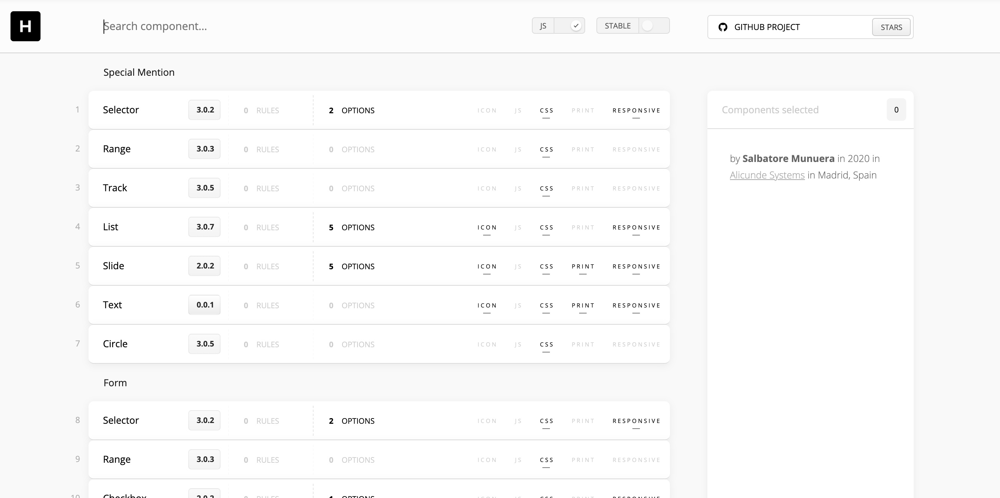

Defining this repository is tricky. It is not a framework. I hope you like it and if you can improve a component leave us an issue.

I really appreciate if you leave me a star, this repository is free and they don't have any kind of license. I have simply created it to play with the HTML.

### [Selector](components/Selector)
#### HTML + CSS

This field is extremely attractive for any type of form. It consists of a simple set of radio type inputs together with labels. You can configure it to have backgrounds or descriptions. It makes use of Flex to give an attractive point to the widths of the options.

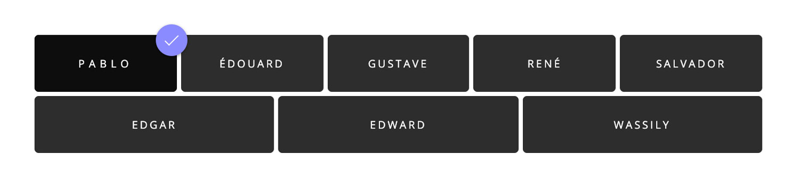
```
<div class="Selector">
    <input type="radio" title="Pablo"   name="selector">
    <input type="radio" title="Édouard" name="selector">
    <input type="radio" title="Gustave" name="selector">
</div>
```

### [Range](components/Range)
#### HTML + CSS

Okay, the native HTML Range is too basic. Reason why it is necessary to use any of the thousands of scripts that exist on the internet. We have included this Range due to its funny and convoluted CSS, I recommend you check how the vertical lines of it have been made. I know that many have tried and few have succeeded, basically I have not found it anywhere.


```
<div class="Range">
    <input type="range" min="0" max="10" step="1" value="5">
</div>
```

### [Div](components/Div)
#### HTML + CSS

The reason for this component is to demonstrate the capacity of the DIV pseudo-elements. Dynamic layouts oriented to customize.

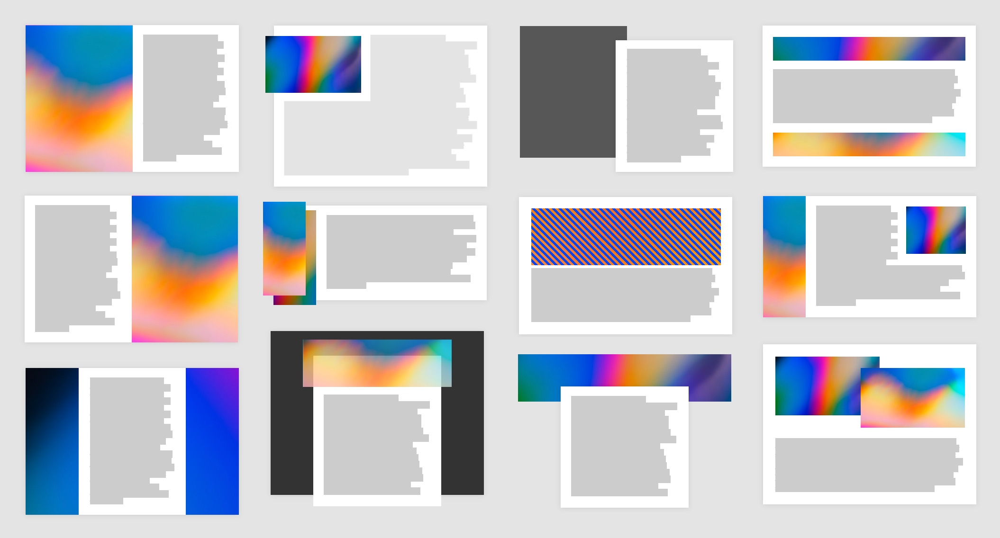
```
<div></div>
```

### [Slide](components/Slide)
#### HTML + CSS

It is my opinion, but this is the most simplified and elegant Slide on the market. It does not make use of duplicate HTML elements for functionality and elegantly resolves controls. It doesn't make use of finite number classes and, thank goodness, it doesn't make use of absolute positioning for dynamic content slides.

It is important to emphasize that this Slide does not offer a design, it offers a structure with the possibility of applying the design that you are interested in applying.

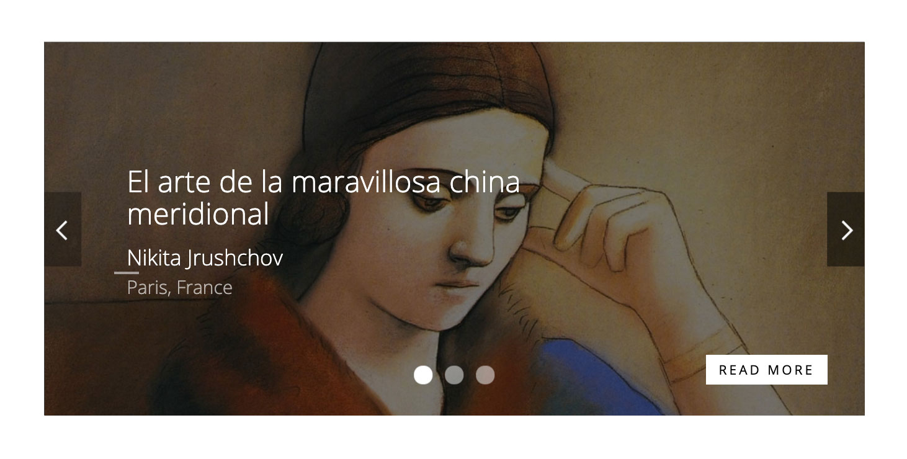
```
<div class="Slide">
    <a id="0" href="#0"></a>
    <div>
        <div>
            2
        </div>
    </div>
    <a id="1" href="#1"></a>
    <div>
        <div>
            1
        </div>
    </div>
</div>
```

### [Password](components/Password)
#### HTML + CSS + JS

Component to insert and validate a password. This component mixes JavaScript with CSS3 capabilities.

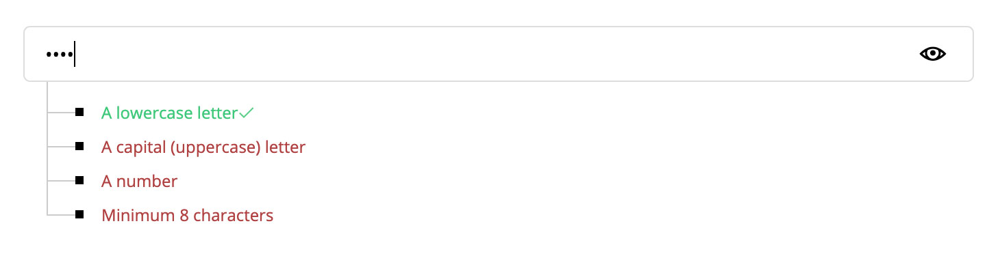
```
<div class="Password">
    <input type="password" autocomplete="off" placeholder="Escribe tu clave">
    <i></i>
    <p>A lowercase letter</p>
    <p>A capital letter</p>
    <p>A number</p>
    <p>Minimum 8 characters</p>
</div>
```

### [Checkbox](components/Checkbox)
#### HTML + CSS

Native component customized with CSS and without the use of JavaScript. We have added a CSS to avoid selecting the component and thus avoid the problem of double clicks.


```
<div class="Checkbox">
    <input type="checkbox" name="example" id="example" />
    <label for="example">I have a bike</label>
</div>
```

### [Progress](components/Progress)
#### HTML + CSS

This item does not offer anything new, it is simply a progress bar.

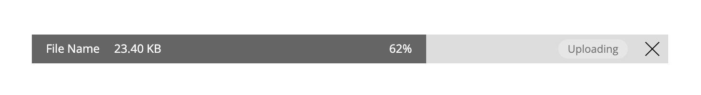
```
<div class="Progress">
    <b title="23.40 KB">File Name</b>
    <div style="width: 48%;">48%</div>
</div>
```

### [Dropdown](components/Dropdown)
#### HTML + CSS

A Dropdown is a dropdown object with different fields inside it. They generally stick to selectors with different options and with the possibility of adding links inside as a list. I have included the option to have fields of type text with optional labels.

It is attractive to know that it does not offer duplication of fields, creating a clean and not convoluted HTML.


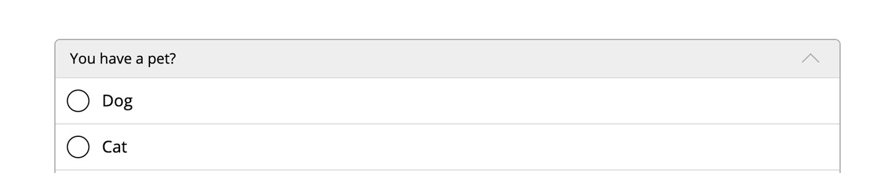
```
<div class="Dropdown">
    <input type="checkbox" id="pet" />
    <label for="pet">You have a pet?</label>
    <ul>
        <li>
            <input type="radio" id="dog" name="pet" value="dog" />
            <label data-title="Yes, I have a dog" for="dog"> Dog</label>
        </li>
    </ul>
</div>
```

### [Select](components/Select)
#### HTML + CSS

One of the most popular objects is the select fields. The proliferation of advanced JavaScript-based select fields has supplied the general need for them. On the other hand, in practically all cases the advantages of continuing to use a native select are greater than those of using a JavaScript-based select.

This component customizes the overall appearance of the select, adding a positioned icon using the Background tag and an SVG.

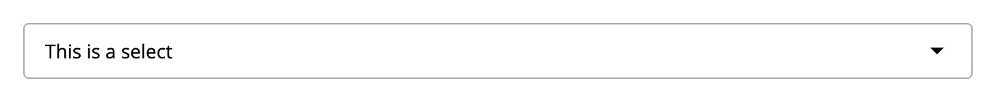
```
<div class="Select">
    <select>
        <option>This is a select</option>
    </select>
</div>
```

### [Rating](components/Rating)
#### HTML + CSS

Field to define a valuation. It does not use JavaScript and the stars are Unicode. The component is built on radio type fields.


```
<div class="Rating">
    <b>Rating the App</b>
    <label for="rating-1">★</label>
    <input type="radio" id="rating-1" name="rating" value="1">
    <label for="rating-2">★</label>
    <input type="radio" id="rating-2" name="rating" value="2">
    <label for="rating-3">★</label>
    <input type="radio" id="rating-3" name="rating" value="3" checked="">
    <label for="rating-4">★</label>
    <input type="radio" id="rating-4" name="rating" value="4">
    <label for="rating-5">★</label>
    <input type="radio" id="rating-5" name="rating" value="5">
    <span></span>
</div>
```

### [Number](components/Number)
#### HTML + CSS + JS

The native number field is limited in certain browsers. Therefore, this component is built using JavaScript.

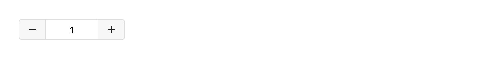
```
<div class="Number">
    <button></button>
    <input type="number" max="10" min="0" value="1">
    <button></button>
</div>
```

### [Textarea](components/Textarea)
#### HTML + CSS

Texting with padding and width 100%. Alternative design in case of being disabled.

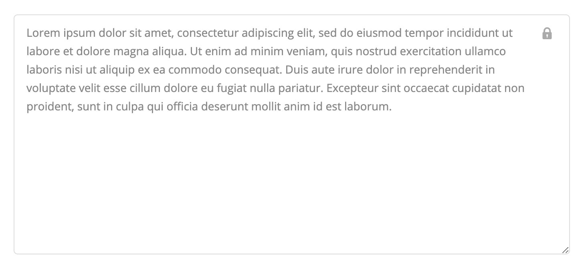
```
<div class="Textarea">
    <textarea readonly placeholder="That is a placeholder...">Lorem ipsum...</textarea>
</div>
```

### [Input](components/Input)
#### HTML + CSS

Component with a field of type Text with the possibility of having a Label positioned absolutely. In turn it also offers a design when disabled by showing a lock.

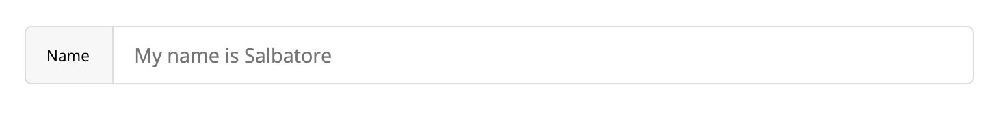
```
<div class="Input">
    <input type="text" readonly="" placeholder="My name is...">
    <label>Name</label>
</div>
```

### [Submit](components/Submit)
#### HTML + CSS

Submit with reset and optional link. Icons generated using CSS3 and without the use of icon fonts. It has responsive capabilities.

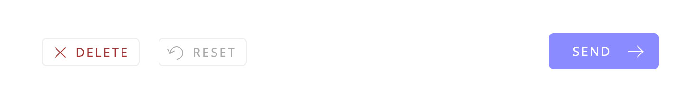
```
<div class="Submit">
    <button type="submit">Send</button>
    <a href="#delete">Delete</a>
    <button type="reset">Reset</button>
</div>
```

### [Radio](components/Radio)
#### HTML + CSS

Component with CSS properties for customization and preserving all the native features of the field. The rendering of the icon is done purely with CSS and does not require fonts.


```
<div class="Radio">
    <input type="radio" id="male" name="gender" value="male">
    <label for="male">Male </label>
    <input type="radio" id="female" name="gender" value="female">
    <label for="female">Female </label>
</div>
```

### [Choice](components/Choice)
#### HTML + CSS

Component developed on checkbox type fields. We make use of pointer-events, to avoid the need to create new HTML objects.

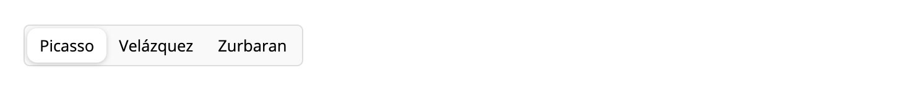
```
<div class="Choice">
    <ul>
        <li><input type="radio" checked="" name="gender"/>Picasso</li>
        <li><input type="radio" name="gender" />Velázquez</li>
    </ul>
</div>
```

### [Track](components/Track)
#### HTML + CSS

Component similar to Range but showing a progress bar. We make use of the shadow of the thumb, giving enough play and making possible many design options. The use of Firefox progress has been avoided, due to errors regarding the size of the Thumb.

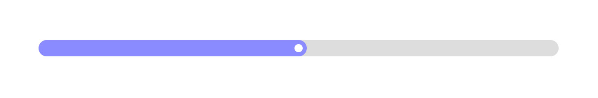
```
<div class="Track">
    <input type="range" min="0" max="1000" step="1" value="500">
</div>
```

### [Limit](components/Limit)
#### HTML + CSS + JS

Field with letter limitation built using JavaScript.

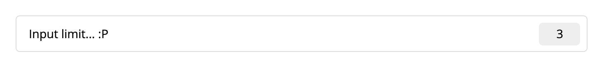
```
<div class="Input">
    <input type="text" maxlength="20" placeholder="My name is Salbatore">
    <em>20</em>
</div>
```

### [Switch](components/Switch)
#### HTML + CSS

Switch field based on a radio type field. Icons generated directly with CSS3.


```
<div class="Switch">
    <input type="checkbox" name="Switch" id="Switch">
    <label for="Switch">I have a bike</label>
</div>
```

### [Colored](components/Colored)
#### HTML + CSS

Basic and stupid color picker using Radio fields.

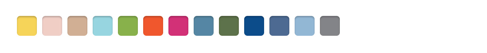
```
<div class="Colored">
    <input type="radio" style="background-color:#f6d258" name="color" />
    <input type="radio" style="background-color:#efcec5" name="color" />
</div>
```

### [Search](components/Search)
#### HTML + CSS

Search type field with optional reset and submit button without using JavaScript.

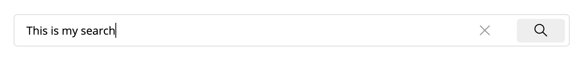
```
<div class="Search">
    <form method="get" action="#test">
        <input type="input" name="q" required="" placeholder="Search...">
        <p>
            <button type="reset">
                <i class="las la-times"></i>
            </button>
            <button type="submit">
                <i class="las la-search"></i>
            </button>
        </p>
    </form>
</div>
```

### [Button](components/Button)
#### HTML + CSS

Set of buttons with icons built in CSS. Unfortunately the use of classes is necessary to define the types and colors. I recommend you consult the CSS and customize them. The icons are positioned absolutely on the object, basically to offer dynamic behavior towards custom fonts.

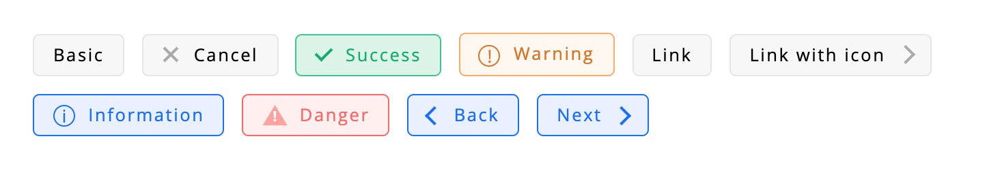
```
<button type="button" class="cancel">Cancel</button>
```

### [Grid](components/Grid)
#### HTML + CSS (not valid, sorry)

We hate grids frameworks. The concept is the concept. The current situation of different screens requires clear and easy solutions to implement. Most of the existing grids on the market focus on combining classes, generating objects with multiple classes. Our strip focuses on the biggest problem of strips, their combination. Initially we developed a rule with thousands of classes, combined in 10 levels and allowing its application by the order of the classes, basically we used the selector ^ =. Unfortunately the result was a CSS that took up 300kb, which is unfeasible. For this reason, we have created a grid based on the attributes **screen**, **desk**, **book**, **tablet** and **phone**. By simply adding the **phone = "five"** attribute, we will have a box with 50% width on screens smaller than 480px. If we put **desktop = "five"** it will be 50% on desktop.

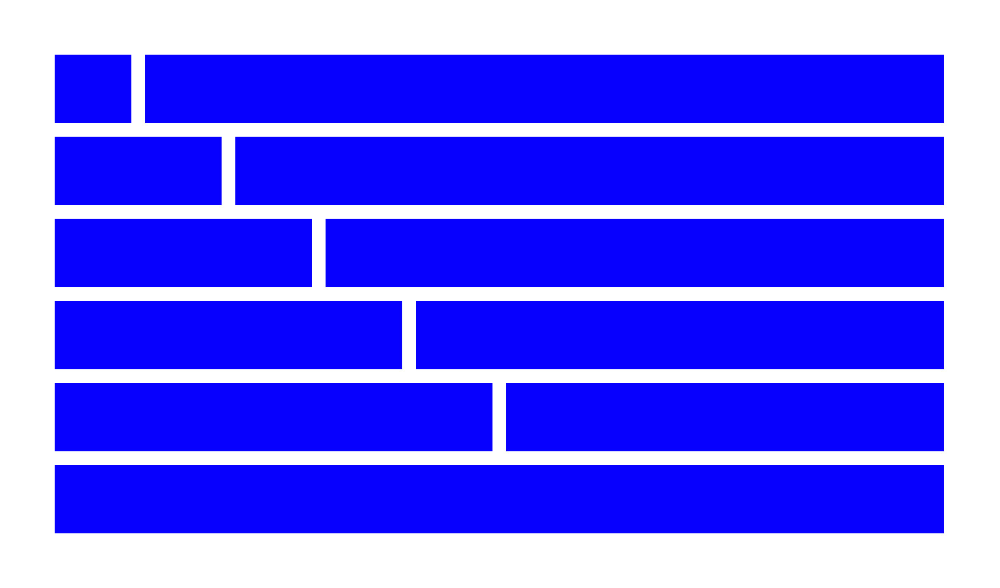
```
<div class="Grid">
    <div screen="100" book="80" desk="60" tablet="40" phone="20" ></div>
</div>
```

### [Background](components/Background)
#### HTML + CSS

Basically a DIV with a background with the possibility of adding a description based on the DIV title. Built to demonstrate the potential of pseudo-elements.

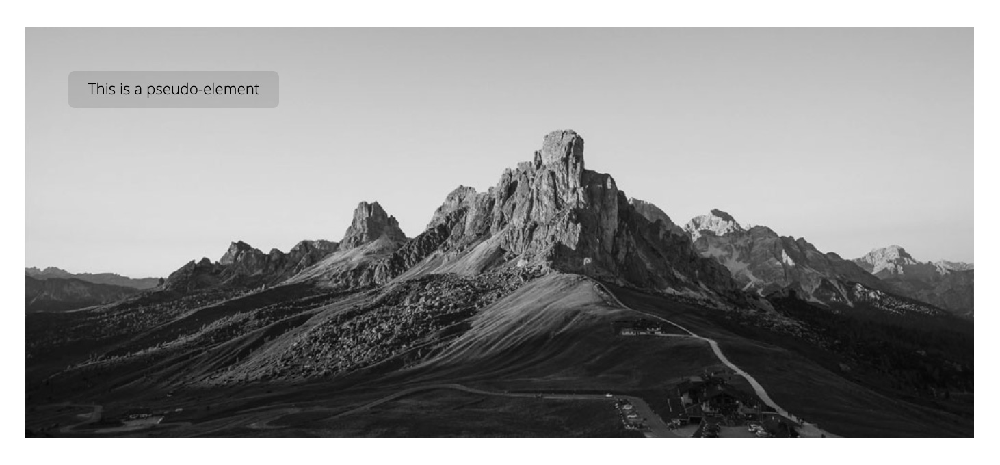
```
<div class="Background" title="This is a pseudo-element"></div>
```

### [Alert](components/Alert)
#### HTML + CSS + ICON FONT

Set of simple alerts, selected by role and class. We use an icon font, although they are not icons using HTML tags. The reason is clear, an icon in an alert is not semantic. If you want to use another font, modify the CSS.

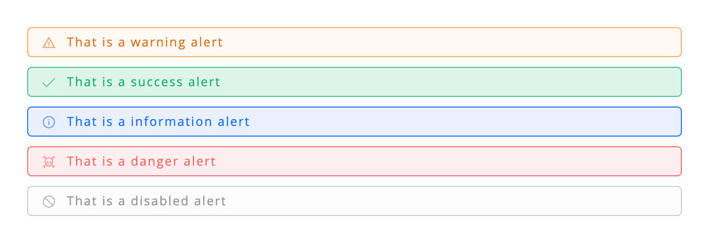
```
<div role="alert">That is a warning alert</div>
```

### [Message](components/Message)
#### HTML + CSS

Customized messages with CSS and semantic HTML. The icons are directly embedded.

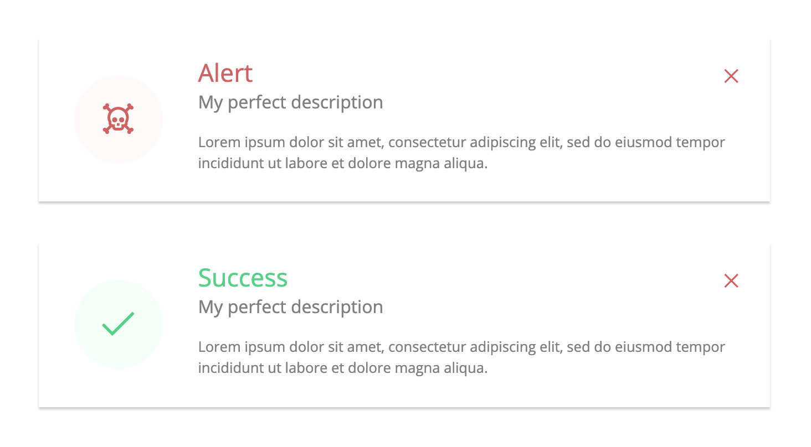
```
<div class="Message">
    <del>Alert</del>
    <span>My perfect description</span>
    <p>Lorem ipsum dolor sit amet, consectetur adipiscing elit.</p>
    <code></code>
</div>
```

### [Slogan](components/Slogan)
#### HTML + CSS

The existence of this component in this repository is motivated by the number of times I have had to build this layout in my life.

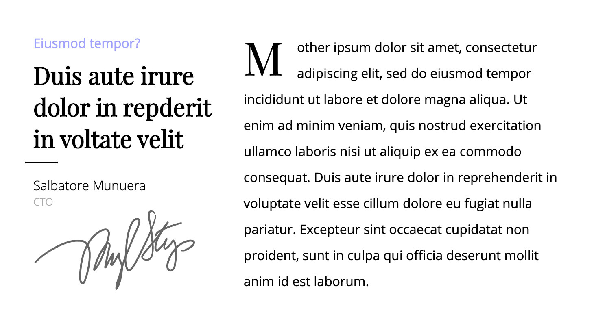
```
<div class="Slogan">
    <q>
        <u>Eiusmod tempor?</u>
        <strong>Duis aute irure dolor in repderit in voltate velit</strong>
        <span>
            <b>Salbatore Munuera</b>
            <i>CTO</i>
        </span>
        
    </q>
    <p>Mother ipsum dolor sit amet...</p>
</div>
```

### [Tooltip](components/Tooltip)
#### HTML + CSS

Tooltip without JavaScript and Hover animations.

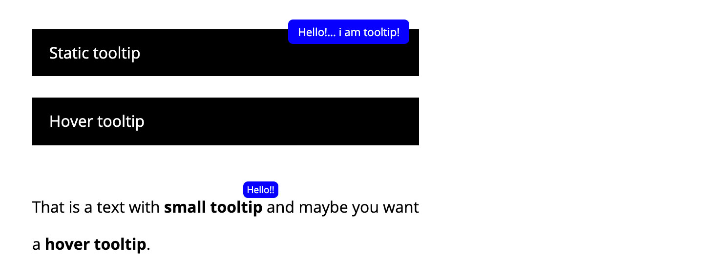
```
<div data-tip="Hello!... i am tooltip!">Static tooltip</div>
<div data-tooltip="Hello!... i am tooltip!">Hover tooltip</div>
<p>That is a text with <b data-tip="Hello!!">small tooltip</b> and maybe you want a <b data-tooltip="Hello!!">hover tooltip</b>.</p>
```

### [Loader](components/Loader)
#### HTML + CSS

Ultra simplified charger without the use of JavaScript.


```
<div class="Loader"></div>
```

### [Shadows](components/Shadows)
#### HTML + CSS

Essential shades.

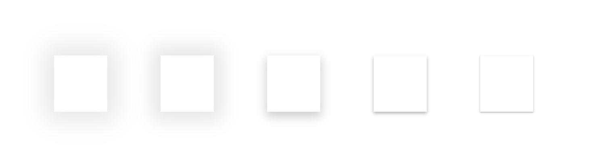
```
<div class="Space">
    <div class="Especially"></div>
    <div class="Above"></div>
    <div class="Below"></div>
    <div class="Middle"></div>
    <div class="Ground"></div>
</div>
```

### [Blur](components/Blur)
#### HTML + CSS

This component is in this repository to demonstrate the existing Blur capabilities in the webkit package. It is not functional in Firefox.

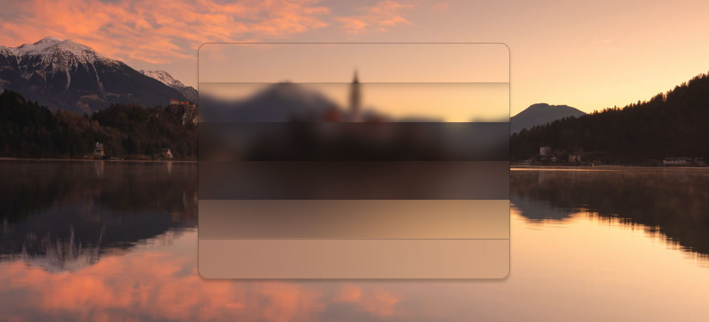
```
<div class="Blur"></div>
```

### [List](components/List) | [Demo](http://html.systems/List) 
#### HTML + CSS

Nested list with a very useful schematic design for administrations. It has an alternative design for printing and responsive capabilities. Its CSS applies styles through inheritance, allowing embedding alternative content without fear of design problems.

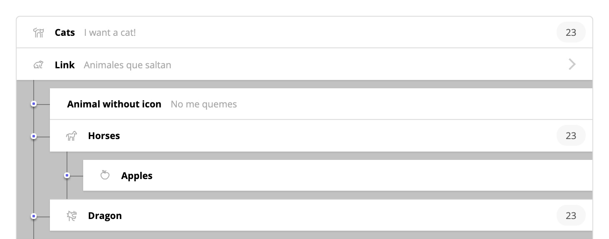
```
<div class="List">
    <ul>
        <li>
            <a href="/example">
                <strong>My link</strong>
            </a>
            <div class="List">
                <ul>
                    <li>
                        <p>
                            <strong>My text</strong>
                        </p>
                    </li>
                </ul>
            </div>
        </li>
    </ul>
</div>
```


### [Comments](components/Comments)
#### HTML + CSS

List of hierarchical comments making exclusive use of semantic HTML and CSS with defined inheritances, allowing different objects to be embedded in the content of the comment. The CSS contains responsive and print functionalities.


```
<div class="Comments">
    <ul>
        <li>
            
            <a href="#test">Salbatore Munuera</a>
            <time>23 minutes</time>
            <p>I love HTML</p>
        </li>
    </ul>
</div>
```

### [Gallery](components/Gallery)
#### HTML + CSS

Simplified photo gallery. The positioning is vertically ordered.

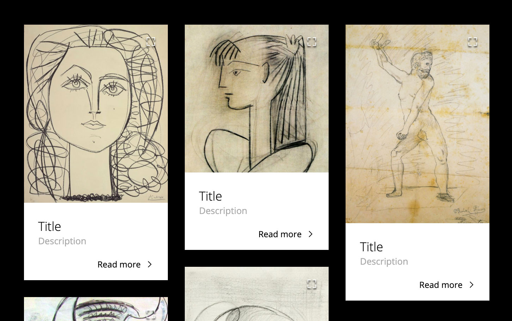
```
<div class="Gallery">
    <ul>
        <li>
            
            <b>Title</b>
            <span>Description</span>
            <a href="#example">Read more</a>
        </li>
    </ul>
</div>
```

### [Articles](components/Articles)
#### HTML + CSS

List of articles using Flex, the date integrated by means of a pseudo object. The date is a functional element, it is not an absolute date of the object.

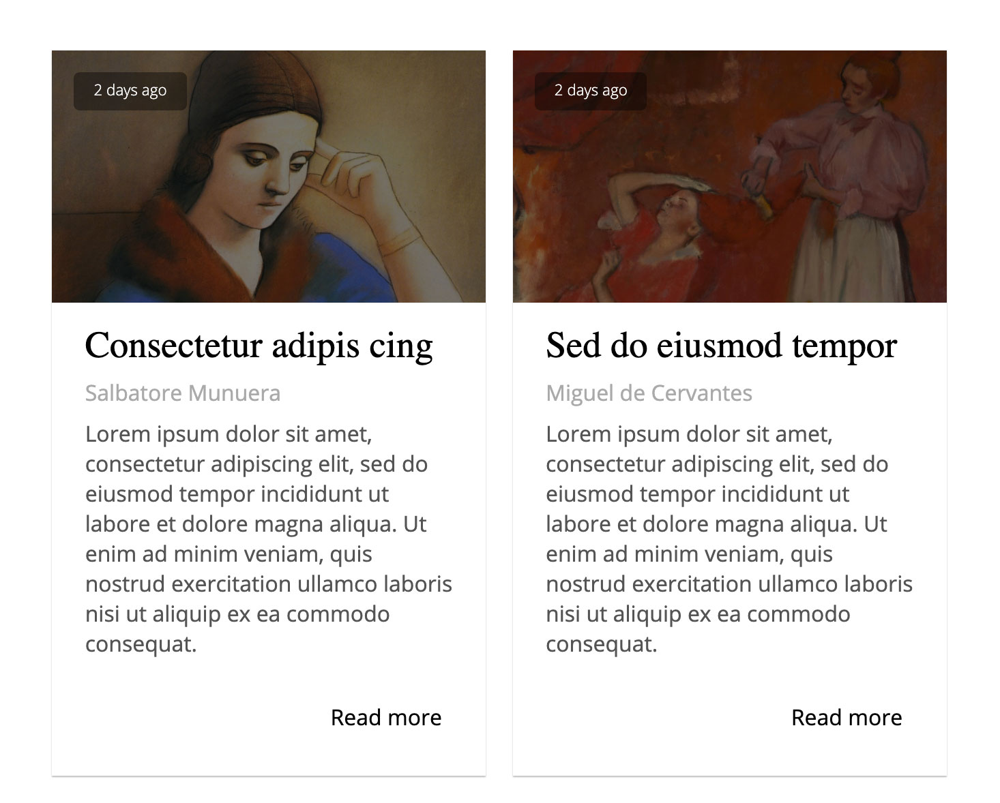
```
<div class="Articles">
    <ul>
        <li>
            <picture title="2 days ago">
                
            </picture>
            <h3>Consectetur adipis cing</h3>
            <strong>Salbatore Munuera</strong>
            <p>Lorem ipsum dolor sit amet, consectetur adipiscing elit.</p>
            <a href="#example">Read more</a>
        </li>
    </ul>
</div>
```

### [Products](components/Products)
#### HTML + CSS

List of products using semantic HTML and with the possibility of embedding Videos.

### [Profiles](components/Profiles)
#### HTML + CSS

List of profiles based on Flex.


```
<div class="Profiles">
    <ul>
        <li>
            <a href="/#test">
                
                <b>Elon Musk</b>
                <span>Elon Musk</span>
            </a>
        </li>
    </ul>
</div>
```

### [Chat](components/Chat)
#### HTML + CSS

Component built to demonstrate how unnecessary complex HTML structures are to create a simple chat. Chat with purely semantic and objectless HTML to meet aesthetic needs.


```
<div class="Chat">
    <ul>
        <li>
            <u>
                <b>Elon Musk</b>
                <span>¿Cómo estas Salbatore?</span>
                <em>11:37</em>
            </u>
        </li>
        <li>
            <p>
                <b>Salbatore Munuera</b>
                <span>Estoy estresado</span>
                <em>16:23</em>
            </p>
        </li>
    </ul>
</div>
```

### [Button](components/Button)
#### HTML + CSS

Set of buttons with icons built in CSS. Unfortunately the use of classes is necessary to define the types and colors. I recommend you consult the CSS and customize them. The icons are positioned absolutely on the object, basically to offer dynamic behavior towards custom fonts.


```
<button type="button" class="cancel">Cancel</button>
```

### [Target](components/Target)
#### HTML + CSS

Accordion based on Targets, it is not intended to replace the Accordion component. An interesting component to be used in listings where it is required to modify the browser scroll directly through the path.

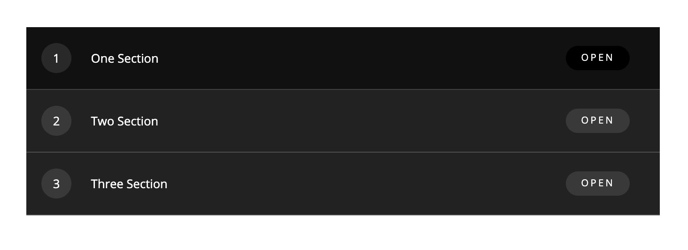
```
<a class="Target" href="#one" id="one">One Section</a>
<div>
    FIRST CONTENT
</div>
<a class="Target" href="#two" id="two">Two Section</a>
<div>
    TWO CONTENT
</div>
```

### [Tabs](components/Tabs)
#### HTML + CSS

Tabs based on hidden radio-type inputs with CSS3 defined with strict inheritance.

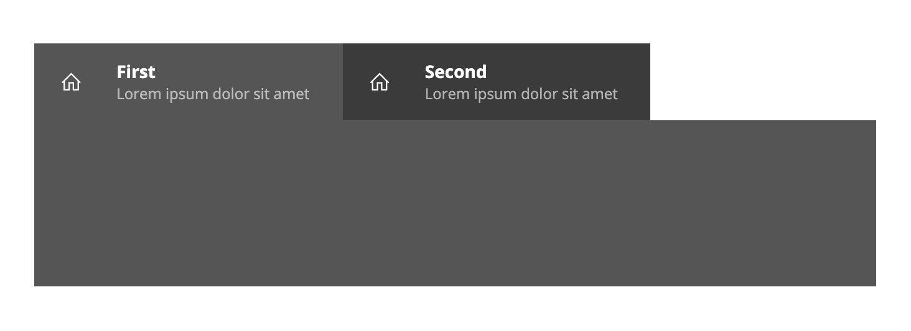
```
<div class="Tabs">
    <input type="radio" id="tab-0" checked name="tab" value="1">
    <label for="tab-0">
        <b>First</b>
    </label>
    <div>
        FIRST CONTENT
    </div>
    <input type="radio" id="tab-1" name="tab" value="2">
    <label for="tab-1">
        <b>Second</b>
    </label>
    <div>
        SECOND CONTENT
    </div>
</div>
```

### [Accordion](components/Accordion)
#### HTML + CSS, no icons, no JavaScript

The CSS has all the definitions with selectors of type ">", allowing to add inside the accordions without fear of inheritance problems. We have added CSS3 animations, although they are not necessary. We have avoided using animations on min-height, due to known problems.

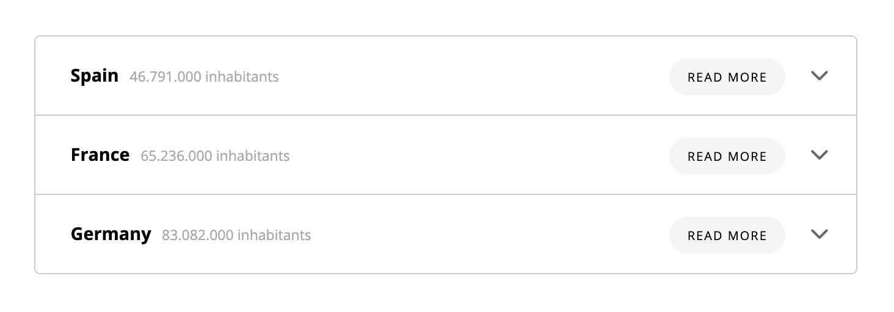
```
<div class="Accordion">
    <ul>
        <li>
            <input type="checkbox" id="1">
            <label for="1">One</label>
            <div>
                Content
            </div>
        </li>
        <li>
            <input type="checkbox" id="2">
            <label for="2">Two</label>
            <div>
                Content
            </div>
        </li>
    </ul>
</div>
```

### [Carrousel](components/Carrousel)
#### HTML + CSS

Carrousel with hidden scroll and animations associated with the hover.

```
<div class="Carrousel">
    <ul>
        <li>
            <a href="#test">
                
                <b>Picasso</b>
                <em>1923</em>
            </a>
        </li>
    </ul>
</div>
```

### [Pagination](components/Pagination)
#### HTML + CSS

Pager with the essential elements with icons built with CSS3. It does not require icon fonts and has alternative versions for small screens.

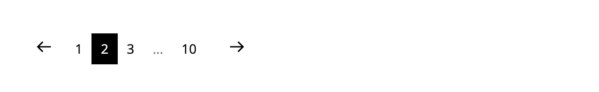
```
<div class="Pagination">
    <strong>23 pages</strong>
    <i>
        <a href="/#test"></a>
    </i>
    <a href="/#test">1</a>
    <a href="/#test" class="active">2</a>
    <a href="/#test">3</a>
    <span>...</span>
    <a href="/#test">10</a>
    <i>
        <a href="/#test"></a>
    </i>
</div>
```

### [Menu](components/Menu)
#### HTML + CSS

Vertical or horizontal menu with responsive properties without the use of JavaScript. Responsive versions display a Burger menu without modifying the component's HTML structure.


```
<nav role="navigation" class="Menu">
    <ul>
        <li>
            <h1>
                <a href="/#test">Logotype</a>
            </h1>
        </li>
        <li>
            <a href="/#test">
                <span>Test</span>
            </a>
        </li>
    </ul>
</nav>
```

### [Breadcrumb](components/Breadcrumb)
#### HTML + CSS

A simple Breadcrumb based on a defined paragraph with a navigation role. The icons are built with CSS, so no attached fonts are required.


```
<p role="navigation">
    <a href="/">Home</a> <span>I love Pepsi</span>
</p>
```

### [Text](components/Text)
#### HTML + CSS

Total set of HTML text tags. The definitive guide.

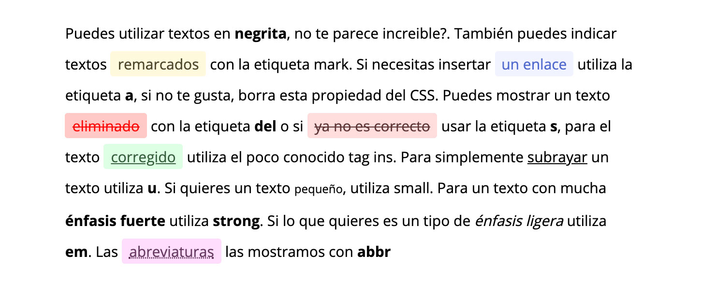
```
<div class="Text">
    <p>This is a text</p>
</div>
```

### [Article](components/Article)
#### HTML + CSS

This component has nothing special, it is simply a construction made with semantic HTML and responsive CSS.

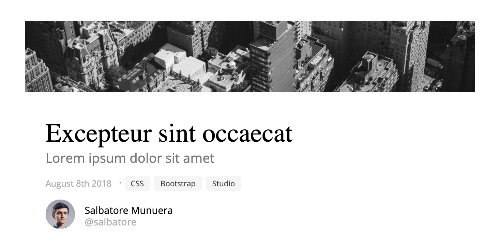
```
<div class="Article">
    
    <h1>Excepteur sint occaecat</h1>
    <h2>Lorem ipsum dolor sit amet</h2>
    <time>August 8th 2018</time>
    <ol>
        <li>
            <a href="#one">One</a>
        </li>
        <li>
            <a href="#two">Two</a>
        </li>
    </ol>
    <strong>
        <span></span>
        <i>Salbatore Munuera</i>
        <em>@salbatore</em>
    </strong>
    <p>Lorem ipsum dolor sit amet, consectetur adipiscing elit</p>
</div>
```

### [Product](components/Product)
#### HTML + CSS

Component to display a product using semantic HTML and without the use of JavaScript. It has responsive capabilities. This component is ideal to be customized.

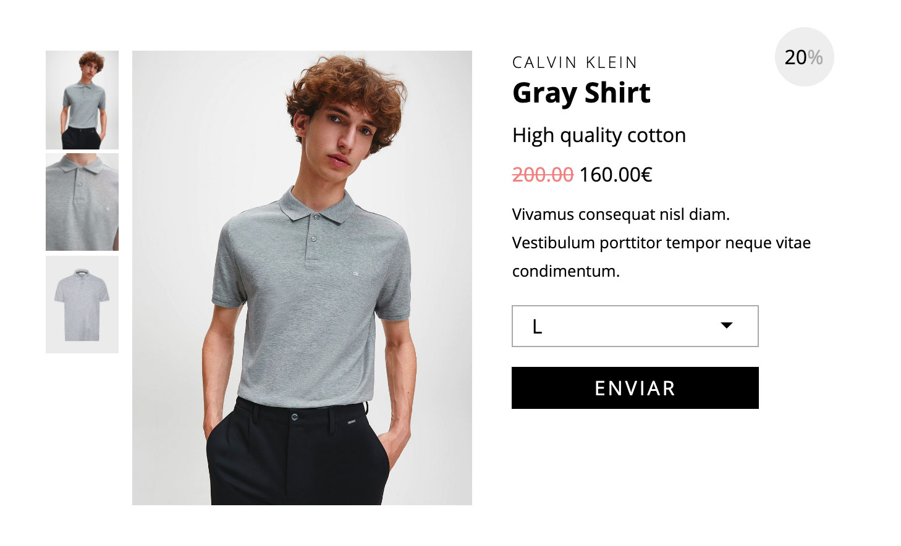
```
<div class="Product">
    <ol>
        <li>
            <input type="radio" checked="" name="picture" id="product-1">
            
        </li>
    </ol>
    <ul>
        <li>
            <label for="product-1">
                
            </label>
        </li>
    </ul>
    <div>
        <h3>Calvin Klein</h3>
        <h1>Gray Shirt</h1>
        <h2>High quality cotton</h2>
        <em>
            <del>200.00</del> 160.00€
        </em>
        <strong>20</strong>
        <p>Vivamus consequat nisl diam. Vestibulum porttitor tempor neque vitae condimentum. </p>
        <form>
            <select>
                <option>L</option>
            </select>
            <input type="submit">
        </form>
    </div>
</div>
```

### [Profile](components/Profile)
#### HTML + CSS

Standard header of a social profile. It has responsive capabilities and makes use of semantic HTML.

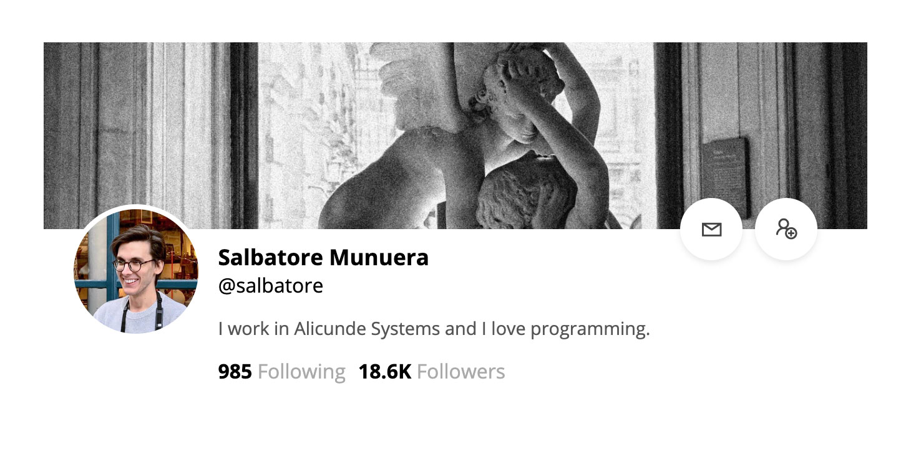
```
<div class="Profile">
    <em></em>
    <span></span>
    <strong>Salbatore Munuera</strong>
    <i>@salbatore</i>
    <p>I work in Alicunde Systems and I love programming.</p>
    <ol>
        <li>
            <a href="#test"></a>
        </li>
        <li>
            <del></del>
        </li>
    </ol>
    <ul>
        <li>
            <b>985</b> Following
        </li>
        <li>
            <b>18.6K</b> Followers
        </li>
    </ul>
</div>
```

### [Prices](components/Prices)
#### HTML + CSS

Ultra simplified pricing table.


```
<div class="Prices">
    <ul>
        <li>
            <h3>Basic</h3>
            <p>Perfect for individuals</p>
            <em>$60<span> / month</span>
            </em>
            <a href="/#test">Try out!</a>
            <ul>
                <li>10 GB <b>storage</b></li>
            </ul>
        </li>
    </ul>
</div>
```

### [Meter](components/Meter)
#### HTML + CSS

Alternative field to the native meter field. Its construction does not make use of CSS designs with dynamic absolute positions.

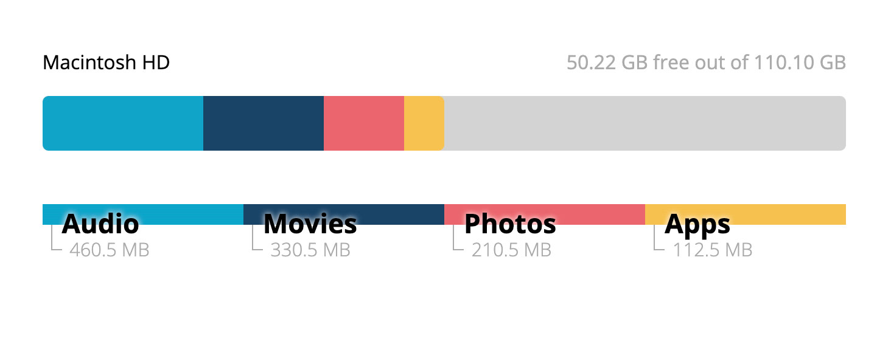
```
<div class="Meter">
    <p>Macintosh HD <span class="free-space">50.22 GB free out of 110.10 GB</span>
    </p>
    <ul>
        <li>
            <u style="width:20%"></u>
            <span>Audio</span>
            <b>460.5 MB</b>
        </li>
    </ul>
</div>
```

### [Counter](components/Counter)
#### HTML + CSS

Very unoriginal object. I have included it in this repository due to the constant use of it in practically any professional landing.

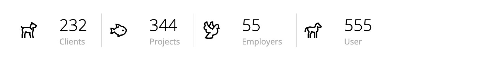
```
<div class="Counter">
    <ul>
        <li>
            <i class="las la-dog"></i>
            <b>232</b>
            <span>Clients</span>
        </li>
    </ul>
</div>
```

### [Range Circle](components/Circle)
#### HTML + CSS (no javascipt)

This component is very crazy. It consists of a circular input field based on a multiple select. This is an experimental component for Chrome. I do not recommend it for any type of production version, I just found it curious to program it.

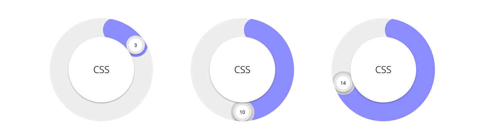
```
<div class="Circle">
    <select size="3">
        <option value="19"></option>
        <option value="17"></option>
        <option value="16"></option>
        [...]
        <option value="3"></option>
        <option value="2"></option>
        <option value="1"></option>
    </select>
</div>
```

### [Pixelate](components/Pixelate)
#### HTML + CSS

Image rendering test


```

```
